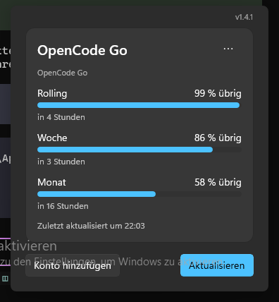

# birdy-creditStatus 🐦

Token-Stände aller AI-Abos auf einen Blick — direkt aus der Windows-Taskleiste.

Klick aufs Tray-Icon → kleines Popup mit den Rest-Kontingenten von **Claude**, **Codex** und **OpenCode Go**. Kein Browser, kein Suchen, kein Raten.



## Features

- 📊 **Alle Stände, ein Popup** — je Konto eine Karte mit Rest in Prozent, Balken und Reset-Zeit („in 2 Stunden")
- 👥 **Multi-Account** — beliebig viele Konten je Anbieter (Name + Auth-Datei), z. B. Haupt- und Zweitlogin nebeneinander
- 🪟 **Atmendes Popup** — Fensterhöhe folgt der Kartenliste; leere Anbieter blenden sich aus statt `n/a`-Rauschen
- 🔄 **App-Update per Rechtsklick** — prüft GitHub Releases, fragt vor der Installation
- 🔕 **Kein Hintergrund-Gedöns** — Abruf nur beim Öffnen + per Button, kein Polling, keine Toasts
- 🔑 **Keine Secrets in der App** — nutzt deine vorhandenen CLI-Logins, nichts wird doppelt abgelegt

## Installieren

1. **[Neuestes Setup laden](https://github.com/CodingEmil/birdy-creditStatus/releases/latest)** (`birdy-creditStatus-Setup-X.Y.Z.exe`)
2. Doppelklick **ohne Admin** (SmartScreen warnt einmal — unsigned, „Trotzdem ausführen")
3. Fertig: Tray-Icon ist da, Autostart ist an (abschaltbar per Rechtsklick)

Nur **Windows 11 (x64)**. Update: Rechtsklick → *App aktualisieren …* oder neue Setup drüberinstallieren.

## Benutzen

- **Linksklick** Tray-Icon → Stände ansehen
- **Konto hinzufügen** → Anbieter wählen, Name + Auth-Datei (dein CLI-Login, z. B. `~/.codex/auth.json`)
- **··· je Karte** → umbenennen / entfernen (löscht nie die Auth-Datei selbst)

## Entwickeln

```powershell
dotnet test tests/BirdyCreditStatus.Core.Tests   # 167 Tests
dotnet build BirdyCreditStatus.slnx              # 0 Warnungen
```

Stack: **.NET 10, C#, WinUI 3**, single-process Tray-App. Installer: Inno Setup 6 (`installer/README.md`). Architektur: `ARCHITECTURE.md`, Domain-Sprache: `CONTEXT.md`, Entscheidungen: `docs/decisions/`.

## Lizenz

MIT — siehe [LICENSE](LICENSE).
