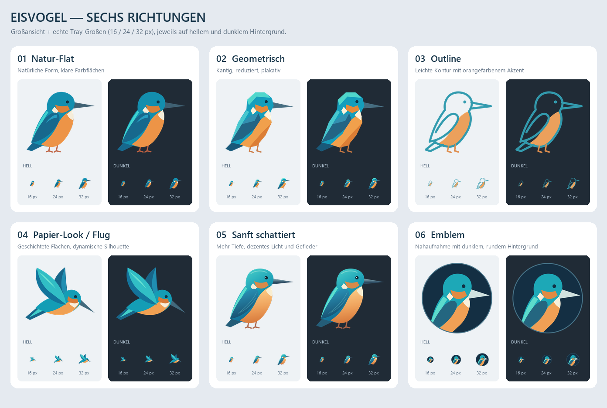

# Eisvogel — Stilvarianten

Status: **Variante 05 „Sanft schattiert“ wurde vom Nutzer ausgewählt und als
produktives App-/Tray-/Installer-Icon übernommen.**

Nutzerwunsch: mehrere Eisvogel-Varianten in verschiedenen Stilen, aufbauend auf
„realistisch und minimalistisch“ mit mehreren Farben und Akzenten. Wiederkehrende
Erkennungsmerkmale: langer gerader Schnabel, blau-türkises Gefieder, orange Brust,
kräftiger Kopf und kurzer Schwanz.

## Vergleich



Die Übersicht zeigt pro Variante eine Großansicht sowie **16, 24 und 32 px** auf
hellem und dunklem Hintergrund. Kleine Größen bei 100 % Bildzoom beurteilen.
Transparente Einzelbilder liegen jeweils als 512-px-PNG neben den editierbaren SVGs.

| Nr. | Stil / Einzelansicht | Charakter |
| --- | --- | --- |
| 01 | [Natur-Flat](01-natur-flat.png) · [SVG](01-natur-flat.svg) | Früherer Eisvogel als Referenz: natürliche Form, klare Farbflächen. |
| 02 | [Geometrisch](02-geometrisch.png) · [SVG](02-geometrisch.svg) | Facettierte, kantige Formen; stärker als grafisches Zeichen reduziert. |
| 03 | [Outline](03-outline.png) · [SVG](03-outline.svg) | Luftige Kontur mit orangefarbener Brust; bewusst filigraner bei 16 px. |
| 04 | [Papier-Look / Flug](04-im-flug.png) · [SVG](04-im-flug.svg) | Überlagerte Flächen und dynamische Flugpose statt sitzendem Profil. |
| 05 | [Sanft schattiert](05-sanft-schattiert.png) · [SVG](05-sanft-schattiert.svg) | **Ausgewählt und übernommen.** Dezente Verläufe, Licht und wenige Gefiederlinien. |
| 06 | [Emblem](06-emblem.png) · [SVG](06-emblem.svg) | Größeres Vogelporträt mit dunklem Kreis; stärkere Flächenwirkung im Tray. |

## Auswahl / Übernahme

- **05 „Sanft schattiert“** ist die explizite Nutzerauswahl. Die gewählte Grafik
  wurde unverändert übernommen; nur der SVG-Titel trägt jetzt den App-Namen.
- Produktive Quelle: `src/BirdyCreditStatus/Assets/BirdyIcon.svg`. ICO und
  Hell-/Dunkel-Vorschau werden mit `scripts/generate-icon.py` daraus erzeugt.
- Die ICO enthält 11 Auflösungen von 16 bis 256 px und wird gemeinsam für Tray,
  EXE, beide WinUI-Fenster und Installer verwendet.
- Die sechs Entwürfe bleiben als unabhängige Vergleichs-Snapshots erhalten;
  01 dokumentiert das frühere Flat-Design. Das Vorschau-Skript ändert keine
  produktiven Assets.
- 03 und 06 bleiben nicht übernommene Alternativen. Die sanften Verläufe und
  Gefiederakzente von 05 gehören nun ausdrücklich zum gewählten Stil.

## Vorschauen neu erzeugen

Gleiche optionale Grafik-Tools wie beim produktiven Icon; kein neuer App-Build nötig:

```text
python -m pip install pillow==12.2.0 resvg-py==0.5.0
python scripts/preview-icon-variants.py
```

Das Skript verändert ausschließlich PNGs in diesem Verzeichnis. SVGs sind die
jeweilige Quelle. Für die Beschriftung wird Segoe UI verwendet, falls vorhanden,
sonst die Pillow-Standardschrift. Die Vektorgrafiken selbst benötigen keine Fonts.
